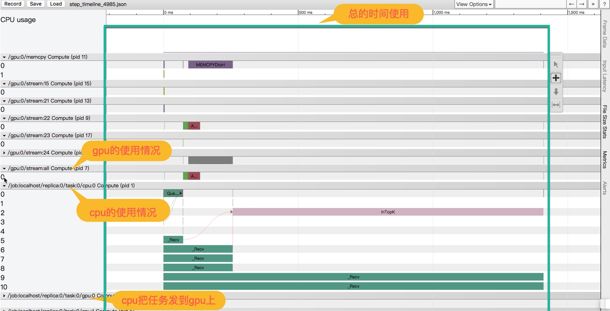
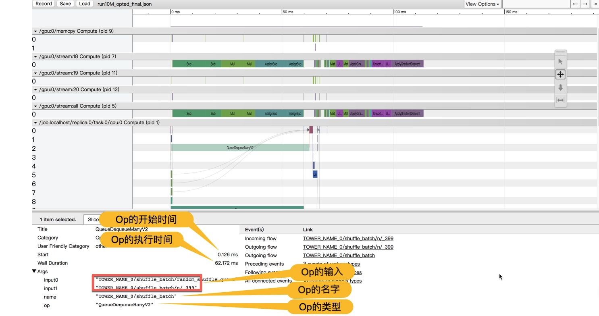

## timeline 使用简要说明       

timeline会生成一个时序图，他将每个op的运行开始时间，结束时间，运行设备，op的前置op, 后置op在图上一一列举出来。  

### 实例  
1. 第一个简单实例  

```  

import tensorflow as tf
from tensorflow.python.client import timeline

x = tf.random_normal([1000, 1000])  # 随机矩阵1000*1000
y = tf.random_normal([1000, 1000])
res = tf.matmul(x, y)

# Run the graph with full trace option
with tf.Session() as sess:
    run_options = tf.RunOptions(trace_level=tf.RunOptions.FULL_TRACE)
    run_metadata = tf.RunMetadata()
    sess.run(res, options=run_options, run_metadata=run_metadata)

    # Create the Timeline object, and write it to a json
    tl = timeline.Timeline(run_metadata.step_stats)
    ctf = tl.generate_chrome_trace_format()
    with open('timeline.json', 'w') as f:
        f.write(ctf)
```  

这段代码会生成timeline.json文件。打开chrome浏览器，输入chrome://tracing, 加载timeline.json文件即可。这段程序是在训练过程利用timeline观察op的过程。接下来介绍加载训练模型对输入数据进行预测的例子  

2. 第二个简单实例  
```  

import tensorflow as tf
import numpy as np
import matplotlib.pyplot as plt
from tensorflow.python.client import timeline

plotdata = {"batchsize": [], "loss": []}

def moving_average(a, w=10):
    if len(a) < w:
        return a[:]
    return [val if idx < w else sum(a[(idx - w):idx]) / w for idx, val in enumerate(a)]

# 生成模拟数据
train_X = np.linspace(-1, 1, 100)
train_Y = 2 * train_X + np.random.randn(*train_X.shape) * 0.3  # y=2x，但是加入了噪声

tf.reset_default_graph()
# 创建模型
# 占位符
X = tf.placeholder("float")
Y = tf.placeholder("float")
# 模型参数
W = tf.Variable(tf.random_normal([1]), name="weight")
b = tf.Variable(tf.zeros([1]), name="bias")
# 前向结构
z = tf.multiply(X, W) + b
# 反向优化
cost = tf.reduce_mean(tf.square(Y - z))
learning_rate = 0.01
optimizer = tf.train.GradientDescentOptimizer(learning_rate).minimize(cost)  # Gradient descent
# 初始化变量
init = tf.global_variables_initializer()
# 参数设置
training_epochs = 20
display_step = 2
saver = tf.train.Saver()    # 生成saver
savedir = "log/"
# 启动session
with tf.Session() as sess:
    sess.run(init)
    # Fit all training data
    for epoch in range(training_epochs):
        for (x, y) in zip(train_X, train_Y):
            sess.run(optimizer, feed_dict={X: x, Y: y})
        # 显示训练中的详细信息
        if epoch % display_step == 0:
            loss = sess.run(cost, feed_dict={X: train_X, Y: train_Y})
            print("Epoch:", epoch + 1, "cost=", loss, "W=", sess.run(W), "b=", sess.run(b))
            if not (loss == "NA"):
                plotdata["batchsize"].append(epoch)
                plotdata["loss"].append(loss)
    saver.save(sess, savedir + "linermodel.ckpt")
    
# 重启一个session 如下代码用于预测新数据

with tf.Session() as sess2:
    sess2.run(tf.global_variables_initializer())
    saver.restore(sess2, savedir + "linermodel.ckpt")
    run_options = tf.RunOptions(trace_level=tf.RunOptions.FULL_TRACE)
    run_metadata = tf.RunMetadata()
    print("x=0.2 ,z=", sess2.run(z, options=run_options, run_metadata=run_metadata, feed_dict={X: 0.2}))

    tl = timeline.Timeline(run_metadata.step_stats)
    ctf = tl.generate_chrome_trace_format()
    with open('timeline.json', 'w') as f:
        f.write(ctf)

```  

这段代码同样会生成timeline.json文件。不同之处在于这段代码是加载训练模型预测的过程，相当于只有前向传播过程，没有反向传播过程。  

### timeline图的使用说明  
1. timeline显示的简单实例1  

  

2. timeline显示的简单实例2  

  

3. timeline的工具说明  

  

##### 第一行selection1(箭头), 用来选取指定区域的op显示在下方
##### 第二行pan2(十字标识), 用于左右拖动
##### 第三行zoom3(上下箭头)，上下拖动可以缩放图中结构
##### 第四行timing4(区间标识)，可以截取一段区间计算该区间时间长度


### 参考资料

1. https://www.jianshu.com/p/937a0ce99f56  
2. https://towardsdatascience.com/howto-profile-tensorflow-1a49fb18073d  
3. chrome://tracing  


